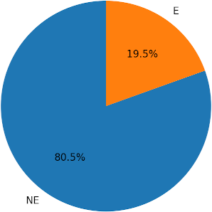
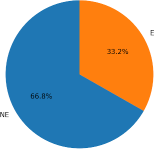

---
  title: BIOMAT sperimentazione
  author: Maurizio Giordano
  date: 10-07-2022
---  
  
# label\_CS\_ACH\_most\_freq (CS0 vs CS6-9)

## Settings

+ 12538 geni complessivi - 3814 labellati
+ Attributi normalizzati con Z-score
+ 5-fold cross validation

## PPI 

#### BIO+GTEX

|     |   Accuracy |       BA |   Sensitivity |   Specificity |      MCC | CM            |
|-----+------------+----------+---------------+---------------+----------+---------------|
| LGBM |   0.904825 | 0.819903 |      0.680537 |      0.959269 | 0.68234 | [[ 507  238]  |
|      |            |          |               |               |         |  [ 125 2944]] |
| XGB |   0.895646 | 0.806577 |      0.660403 |      0.952751 | 0.651845 | [[ 492  253]  |
|     |            |          |               |               |          |  [ 145 2924]] |
| MLP |   0.855275 | 0.690011 |      0.418792 |      0.961229 | 0.475601 | [[ 312  433]  |
|     |            |          |               |               |          |  [ 119 2950]] |
| RF |   0.879919 | 0.727178 |       0.47651 |      0.977846 | 0.574159 | [[ 355  390]  |
|    |            |          |               |               |          |  [  68 3001]] |

#### BIO+GTEX+Node2Vec

|     |   Accuracy |       BA |   Sensitivity |   Specificity |      MCC | CM            |
|-----+------------+----------+---------------+---------------+----------+---------------|
| LGBM |   0.927635 | 0.849832 |      0.722148 |      0.977516 | **0.758463** | [[ 538  207]  |
|      |            |          |               |               |          |  [  69 3000]] |
| XGB |   0.922654 | 0.842672 |      0.711409 |      0.973935 | 0.741349 | [[ 530  215]  |
|     |            |          |               |               |          |  [  80 2989]] |
| MLP |   0.918984 | **0.856145** |       0.75302 |       0.95927 | 0.735039 | [[ 561  184]  |
|     |            |          |               |               |          |  [ 125 2944]] |
| RF |   0.899582 | 0.762774 |      0.538255 |      0.987293 | 0.652522 | [[ 401  344]  |
|    |            |          |               |               |          |  [  39 3030]] |

#### BIO+GTEX+DeepWalk

|     |   Accuracy |       BA |   Sensitivity |   Specificity |      MCC | CM            |
|-----+------------+----------+---------------+---------------+----------+---------------|
| LGBM |    0.92554 | 0.83989 |      0.699329 |      0.980452 | **0.749946** | [[ 521  224]  |
|      |            |         |               |               |          |  [  60 3009]] |
| XGB |   0.923177 | 0.839947 |      0.703356 |      0.976538 | 0.742353 | [[ 524  221]  |
|     |            |          |               |               |          |  [  72 2997]] |
| MLP |   0.917932 | **0.851427** |      0.742282 |      0.960571 | 0.730933 | [[ 553  192]  |
|     |            |          |               |               |          |  [ 121 2948]] |
| RF |   0.896962 | 0.755046 |      0.522148 |      0.987944 | 0.641838 | [[ 389  356]  |
|    |            |          |               |               |          |  [  37 3032]] |

#### BIO+GTEX+HOPE

|     |   Accuracy |      BA |   Sensitivity |   Specificity |     MCC | CM            |
|-----+------------+---------+---------------+---------------+---------+---------------|
| LGBM |   0.905873 | 0.819539 |      0.677852 |      0.961227 | 0.685103 | [[ 505  240]  |
|      |            |          |               |               |          |  [ 119 2950]] |
| XGB |   0.904826 | 0.81838 |       0.67651 |       0.96025 | 0.68186 | [[ 504  241]  |
|     |            |         |               |               |         |  [ 122 2947]] |
| MLP |   0.850291 | 0.740279 |      0.559732 |      0.920827 | 0.504984 | [[ 417  328]  |
|     |            |          |               |               |          |  [ 243 2826]] |
| RF |   0.869166 | 0.721006 |      0.477852 |       0.96416 | 0.535904 | [[ 356  389]  |
|    |            |          |               |               |          |  [ 110 2959]] |

<!---
#### BIO+GTEX+RandNE)

|     |   Accuracy |       BA |   Sensitivity |   Specificity |      MCC | CM            |
|-----+------------+----------+---------------+---------------+----------+---------------|
| XGB |   0.901417 | 0.80813 |      0.655034 |      0.961226 | 0.66786 | [[ 488  257]  |
|     |            |         |               |               |         |  [ 119 2950]] |
| RF |   0.876506 | 0.731665 |       0.49396 |      0.969369 | 0.56255 | [[ 368  377]  |
|    |            |          |               |               |         |  [  94 2975]] |
-->

## MET

#### BIO+GTEX

|     |   Accuracy |       BA |   Sensitivity |   Specificity |    MCC | CM            |
|-----+------------+----------+---------------+---------------+--------+---------------|
| LGBM |   0.904825 | 0.819903 |      0.680537 |      0.959269 | 0.68234 | [[ 507  238]  |
|      |            |          |               |               |         |  [ 125 2944]] |
| XGB |   0.898268 | 0.813797 |      0.675168 |      0.952425 | 0.662255 | [[ 503  242]  |
|     |            |          |               |               |          |  [ 146 2923]] |
| MLP |   0.851865 | 0.682809 |      0.405369 |      0.960249 | 0.459727 | [[ 302  443]  |
|     |            |          |               |               |          |  [ 122 2947]] |

#### BIO+GTEX+Node2Vec

|     |   Accuracy |       BA |   Sensitivity |   Specificity |      MCC | CM            |
|-----+------------+----------+---------------+---------------+----------+---------------|
| LGBM |    0.88752 | 0.778658 |           0.6 |      0.957316 | 0.616504 | [[ 447  298]  |
|      |            |          |               |               |          |  [ 131 2938]] |
| XGB |   0.888308 | 0.780163 |      0.602685 |      0.957642 | 0.619234 | [[ 449  296]  |
|     |            |          |               |               |          |  [ 130 2939]] |
| MLP |   0.812011 | 0.656522 |      0.401342 |      0.911701 | 0.348635 | [[ 299  446]  |
|     |            |          |               |               |          |  [ 271 2798]] |

#### BIO+GTEX+DeepWalk
|     |   Accuracy |       BA |   Sensitivity |   Specificity |      MCC | CM            |
|-----+------------+----------+---------------+---------------+----------+---------------|
| LGBM |   0.887782 | 0.77882 |           0.6 |       0.95764 | 0.616964 | [[ 447  298]  |
|      |            |         |               |               |          |  [ 130 2939]] |
| XGB |   0.886733 | 0.776644 |      0.595973 |      0.957315 | 0.613232 | [[ 444  301]  |
|     |            |          |               |               |          |  [ 131 2938]] |
| MLP |   0.817516 | 0.665533 |      0.416107 |      0.914958 | 0.36788 | [[ 310  435]  |
|     |            |          |               |               |         |  [ 261 2808]] |

#### BIO+GTEX+HOPE
|     |   Accuracy |       BA |   Sensitivity |   Specificity |      MCC | CM            |
|-----+------------+----------+---------------+---------------+----------+---------------|
| LGBM |   0.905081 | 0.820573 |      0.681879 |      0.959266 | 0.68309 | [[ 508  237]  |
|      |            |          |               |               |         |  [ 125 2944]] |
| XGB |    0.89643 | 0.810114 |      0.668456 |      0.951771 | 0.656043 | [[ 498  247]  |
|     |            |          |               |               |          |  [ 148 2921]] |
| MLP |   0.821444 | 0.629857 |      0.315436 |      0.944277 | 0.335774 | [[ 235  510]  |
|     |            |          |               |               |          |  [ 171 2898]] |

## MET+PPI 

#### BIO+GTEX

|     |   Accuracy |       BA |   Sensitivity |   Specificity |      MCC | CM            |
|-----+------------+----------+---------------+---------------+----------+---------------|
| LGBM |   0.904825 | 0.819903 |      0.680537 |      0.959269 | 0.68234 | [[ 507  238]  |
|      |            |          |               |               |         |  [ 125 2944]] |
| XGB |   0.898531 | 0.809385 |      0.663087 |      0.955682 | 0.660859 | [[ 494  251]  |
|     |            |          |               |               |          |  [ 136 2933]] |
| MLP |    0.85606 | 0.68999 |       0.41745 |      0.962531 | 0.477454 | [[ 311  434]  |
|     |            |         |               |               |          |  [ 115 2954]] |

#### BIO+GTEX+Node2Vec

|     |   Accuracy |       BA |   Sensitivity |   Specificity |      MCC | CM            |
|-----+------------+----------+---------------+---------------+----------+---------------|
| LGBM |   0.925012 | 0.847187 |      0.719463 |      0.974911 | 0.749644 | [[ 536  209]  |
|      |            |          |               |               |          |  [  77 2992]] |
| XGB |   0.923966 | 0.849077 |      0.726174 |       0.97198 | **0.746896** | [[ 541  204]  |
|     |            |          |               |               |          |  [  86 2983]] |
| MLP |   0.912691 | 0.844103 |      0.731544 |      0.956662 | 0.713719 | [[ 545  200]  |
|     |            |          |               |               |          |  [ 133 2936]] |

#### BIO+GTEX+DeepWalk
|     |   Accuracy |       BA |   Sensitivity |   Specificity |     MCC | CM            |
|-----+------------+----------+---------------+---------------+---------+---------------|
| LGBM |     0.9237 | 0.84129 |       0.70604 |       0.97654 | **0.744371** | [[ 526  219]  |
|      |            |         |               |               |          |  [  72 2997]] |
| XGB |   0.921606 | 0.842528 |      0.712752 |      0.972305 | 0.73816 | [[ 531  214]  |
|     |            |          |               |               |         |  [  85 2984]] |
| MLP |   0.918719 | 0.855981 |       0.75302 |      0.958942 | 0.735141 | [[ 561  184]  |
|     |            |          |               |               |          |  [ 126 2943]] |

#### BIO+GTEX+HOPE
|     |   Accuracy |       BA |   Sensitivity |   Specificity |      MCC | CM            |
|-----+------------+----------+---------------+---------------+----------+---------------|
| LGBM |   0.899578 | 0.811562 |      0.667114 |       0.95601 | 0.664508 | [[ 497  248]  |
|      |            |          |               |               |          |  [ 135 2934]] |
| XGB |   0.901151 | 0.813047 |      0.668456 |      0.957638 | 0.669963 | [[ 498  247]  |
|     |            |          |               |               |          |  [ 130 2939]] |
| MLP |   0.806504 | 0.688677 |      0.495302 |      0.882053 | 0.38051 | [[ 369  376]  |
|     |            |          |               |               |         |  [ 362 2707]] |

# label\_CS\_ACH\_most\_freq (CS0-1 vs CS6-9)

## Settings

+ 12538 geni complessivi - 4596 labellati
+ Attributi normalizzati con Z-score
+ 5-fold cross validation

## PPI 

#### BIO+GTEX

|     |   Accuracy |       BA |   Sensitivity |   Specificity |      MCC | CM            |
|-----+------------+----------+---------------+---------------+----------+---------------|
| XGB |   0.834859 | 0.805927 |      0.719706 |      0.892147 | 0.622746 | [[1099  428]  |
|     |            |          |               |               |          |  [ 331 2738]] |

#### BIO+GTEX+Node2Vec

|     |   Accuracy |       BA |   Sensitivity |   Specificity |      MCC | CM            |
|-----+------------+----------+---------------+---------------+----------+---------------|
| XGB |    0.87141 | 0.843989 |      0.762265 |      0.925713 | **0.705343** | [[1164  363]  |
|     |            |          |               |               |          |  [ 228 2841]] |

#### BIO+GTEX+DeepWalk

|     |   Accuracy |       BA |   Sensitivity |   Specificity |      MCC | CM            |
|-----+------------+----------+---------------+---------------+----------+---------------|
| XGB |    0.86619 | 0.838436 |      0.755725 |      0.921147 | 0.693355 | [[1154  373]  |
|     |            |          |               |               |          |  [ 242 2827]] |

#### BIO+GTEX+HOPE

|     |   Accuracy |      BA |   Sensitivity |   Specificity |     MCC | CM            |
|-----+------------+---------+---------------+---------------+---------+---------------|
| XGB |   0.844431 | 0.814736 |      0.726242 |       0.90323 | 0.643618 | [[1109  418]  |
|     |            |          |               |               |          |  [ 297 2772]] |

## MET

#### BIO+GTEX

|     |   Accuracy |       BA |   Sensitivity |   Specificity |    MCC | CM            |
|-----+------------+----------+---------------+---------------+--------+---------------|
| XGB |   0.835512 | 0.808063 |       0.72626 |      0.889866 | 0.624804 | [[1109  418]  |
|     |            |          |               |               |          |  [ 338 2731]] |

#### BIO+GTEX+Node2Vec

|     |   Accuracy |       BA |   Sensitivity |   Specificity |      MCC | CM            |
|-----+------------+----------+---------------+---------------+----------+---------------|
| XGB |    0.81941 | 0.784651 |      0.681067 |      0.888235 | 0.584655 | [[1040  487]  |
|     |            |          |               |               |          |  [ 343 2726]] |
#### BIO+GTEX+DeepWalk
|     |   Accuracy |       BA |   Sensitivity |   Specificity |      MCC | CM            |
|-----+------------+----------+---------------+---------------+----------+---------------|
| XGB |   0.823112 | 0.790231 |      0.692228 |      0.888235 | 0.59403 | [[1057  470]  |
|     |            |          |               |               |         |  [ 343 2726]] |
#### BIO+GTEX+HOPE
|     |   Accuracy |       BA |   Sensitivity |   Specificity |      MCC | CM            |
|-----+------------+----------+---------------+---------------+----------+---------------|
| XGB |   0.838556 | 0.810175 |      0.725597 |      0.894753 | 0.631054 | [[1108  419]  |
|     |            |          |               |               |          |  [ 323 2746]] |

## MET+PPI 

#### BIO+GTEX

|     |   Accuracy |       BA |   Sensitivity |   Specificity |      MCC | CM            |
|-----+------------+----------+---------------+---------------+----------+---------------|
| XGB |   0.834859 | 0.805099 |      0.716423 |      0.893775 | 0.622204 | [[1094  433]  |
|     |            |          |               |               |          |  [ 326 2743]] |

#### BIO+GTEX+Node2Vec

|     |   Accuracy |       BA |   Sensitivity |   Specificity |      MCC | CM            |
|-----+------------+----------+---------------+---------------+----------+---------------|
| XGB |   0.869673 | 0.841707 |      0.758352 |      0.925063 | **0.701411** | [[1158  369]  |
|     |            |          |               |               |          |  [ 230 2839]] |

#### BIO+GTEX+DeepWalk
|     |   Accuracy |       BA |   Sensitivity |   Specificity |     MCC | CM            |
|-----+------------+----------+---------------+---------------+---------+---------------|
| XGB |   0.870105 | 0.842687 |      0.760966 |      0.924408 | **0.702427** | [[1162  365]  |
|     |            |          |               |               |          |  [ 232 2837]] |

#### BIO+GTEX+HOPE
|     |   Accuracy |       BA |   Sensitivity |   Specificity |      MCC | CM            |
|-----+------------+----------+---------------+---------------+----------+---------------|
| XGB |   0.837686 | 0.808041 |      0.719702 |      0.896381 | 0.628516 | [[1099  428]  |
|     |            |          |               |               |          |  [ 318 2751]] |

# Label Comparison

Using LGBM and Node2Vec su PPI

|      |   Accuracy |       BA |   Sensitivity |   Specificity |      MCC | CM            |
|------+------------+----------+---------------+---------------+----------+---------------|
| EPGAT_OGEE |   0.702198 | 0.690822 |      0.587823 |       0.79382 | 0.391678 | [[3186 2234]  |
|      |            |          |               |               |          |  [1395 5371]] |
| avana_OGEE |   0.939861 | 0.599067 |      0.207595 |      0.990539 | 0.331268 | [[  164   626]  |
|      |            |          |               |               |          |  [  108 11307]] |
| sanger_OGEE |   0.939479 | 0.640307 |      0.290019 |      0.990596 | 0.429063 | [[  250   612]  |
|      |            |          |               |               |          |  [  103 10849]] |

# Analisi dei Risultati

## Non è un problema binario
+ il raggruppamento CS0 vs CS6-9 che consente di trattare il problema della classificazione binaria dei geni come Essensziali/Non-essenziali fornisce le migliori prestazioni
 - esiste una zona grigia che o non riusciamo a trattare
 - … oppure non è trattabile perché la nozione di essenzialità dei geni non è binaria ma piuttosto una nozione variabile continuamente tra valori estremi di essenzialità e non essenzialità. Inevitabilmente ci sono geni meno essenziali, oppure lo sono più  meno essenziali al variare di altri parametri di cui non teniamo conto.
 - La definizione di questi due raggruppamenti CS0 e CS6-9 sulla base dei dati sperimentali dei knock-out delle linee di cellule è la più appropriata, rispetto ad altre definizioni di label (vedi avana0, avana10, etc.). Il lavoro che ha condotto a questa definizione è di contributo significativo e andrà da mettere in risalto nei prossimi lavori.  

## L’embedding rappresenta bene la topologia della rete

+ L’embedding funziona, dà un contributo in termini di rappresentazione della topologia della rete. che sia la rete PPI, MET o l’integrata
	- l’aggiunta degli attributi di embedding aumenta le performance rispetto alla classificazione ottenuta solo sulla base degli attributi BIO e GTEX (no rete).
	- rispetto al paper “Data Sciencie in Applications” 
		- l’MCC incrementa da 0.64  a 0.74
		- l’embedding è calcolato sull’intera rete (non quella ridotta ai nodi labellati) 
		- migliori metodi: Node2Vec, DeepWalk, HOPE
	- Magari l’embedding può essere migliorato considerando che tutti i metodi finora utilizzati lavorano su archi non pesati e grafi unidirezionali (informazione saliente in MET e rete integrata)

## La rete integrata non sembra dare un contributo

+ la rete MET+PPI degrada leggermente le performance rispetto ai risultati ottenuti con la singola PPI (da investigare ulteriormente)
	- forse dovuto al fatto che non consideriamo nell’embedding la direzionalità degli archi MET
	- … oppure dovuto al fatto che praticamente le reti PPI e MET hanno quasi nulla sovrapposizione  (discusso con Ilaria)
		- 11105 archi condivisi da PPI e MET su un totale di 1 milione di archi!!!
		- le due reti appaiono separate: quando analizziamo la rete integrata praticamente processiamo due reti separatamente, e quindi di integrazione c’è ben poco. 

